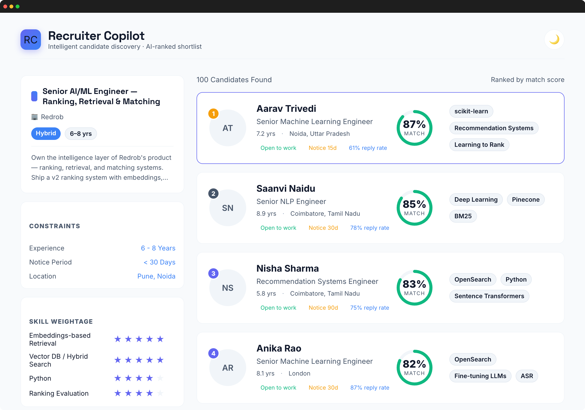
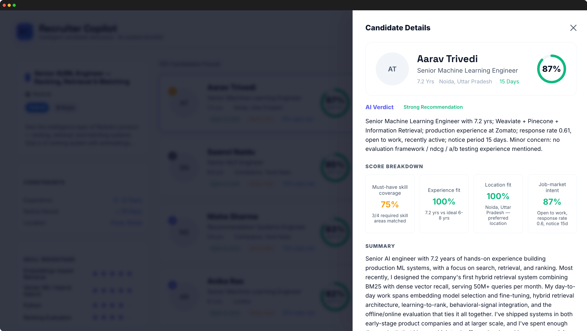
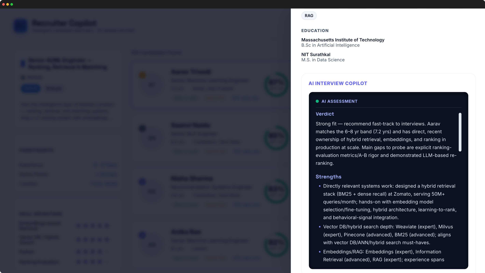
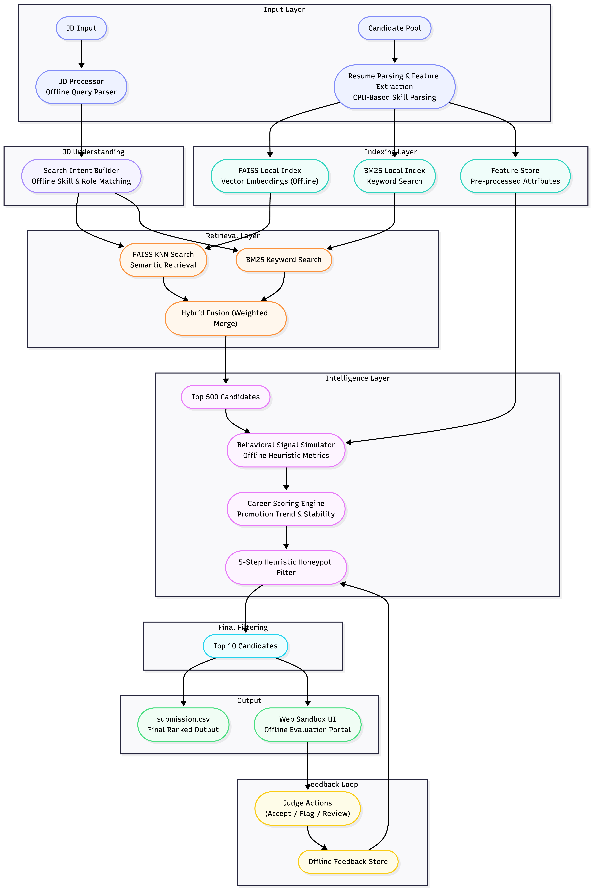

<div align="center">
  <a href="https://github.com/mrmayankmathur/intelligent_candidate_discovery">
    <h1>Intelligent Candidate Discovery</h1>
  </a>
</div>
<p align="center">The intelligent, constraint-aware candidate ranking engine.</p>
<p align="center">
  <a href="https://github.com/mrmayankmathur/intelligent_candidate_discovery"></a>
  <a href="https://github.com/mrmayankmathur/intelligent_candidate_discovery"></a>
  <a href="https://github.com/mrmayankmathur/intelligent_candidate_discovery"></a>
  <a href="https://github.com/mrmayankmathur/intelligent_candidate_discovery"></a>
</p>

<p align="justify" style="font-size: 14px;">
  <strong>Intelligent Candidate Discovery</strong> is an advanced, constraint-aware candidate ranking platform. Designed to operate completely offline under strict compute limits, the core system is a <strong>Python</strong>-based ranking engine that evaluates <strong>100,000</strong>+ candidates locally using pre-computed FAISS vector indexes (BGE-small embeddings) and a deduplicated <strong>BM25</strong> text index. By fusing semantic and keyword retrieval via Reciprocal Rank Fusion (RRF) and passing candidates through a rigorous <strong>5-step</strong> heuristic honeypot filter, the engine successfully isolates highly qualified AI/ML engineers from resume-stuffers. The final top <strong>100</strong> list is surfaced in a polished, interactive Spring Boot and Kotlin/JS web sandbox.
</p>

### Frontend UI Previews

<div style="text-align: center;">
  
  <br>
  
  <br>
  
</div>


### Architecture



---

### Installation

```bash
# Clone the repository
git clone https://github.com/mrmayankmathur/intelligent_candidate_discovery && cd intelligent_candidate_discovery

# Fetch precomputed artifacts and the baked embedding model
git lfs install && git lfs pull        

# Install dependencies (only needed for local non-Docker runs)
pip install -r ranker/requirements.txt
```

> [!TIP]
> Pre-computation is already done. The embeddings, FAISS index, and BM25 corpus are checked into the repo via Git LFS.

### Reproducing the Submission

The judged ranking step runs CPU-only with **no network**. Build once, then run:

```bash
docker build -t icd-ranker -f ranker/Dockerfile .

mkdir -p output
docker run --rm \
  --memory=16g \
  --network=none \
  -v $(pwd)/dataset:/data:ro \
  -v $(pwd)/output:/output \
  icd-ranker

# Validate the result (must be exactly 100 rows)
python dataset/validate_submission.py output/submission.csv
```

### Web UI Sandbox

The interactive visual frontend lets you explore candidate profiles and AI-generated reasoning. To run the sandbox locally:

```bash
cd webapp
./gradlew :backend:bootRun
```

Then navigate to `http://localhost:8080`.

### Directory Structure

- `ranker/`: The core Python ranking engine.
- `webapp/`: The Spring Boot + Kotlin/JS sandbox demo.
- `dataset/`: Hackathon data files.
- `submission.csv`: The final generated submission output.
