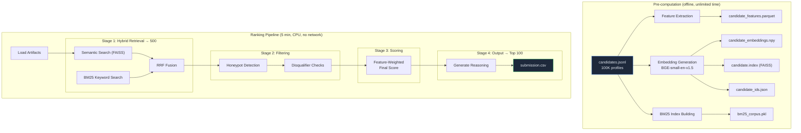

# Intelligent Candidate Discovery — Ranking Engine

> **Given a job description and 100,000 candidate profiles, surface the top 100 best-fit candidates in under 5 minutes — on CPU, with no network access.**

This is the core ranking engine for the Intelligent Candidate Discovery hackathon challenge. It implements a multi-stage retrieval-and-ranking pipeline that combines semantic search, keyword matching, behavioral signal analysis, and rule-based filtering to produce a high-precision ranked list of candidates for any given job description.

---

## Architecture



### Pipeline Stages

| Stage | What it does | Output |
|-------|-------------|--------|
| **1. Hybrid Retrieval** | FAISS semantic search + BM25 keyword search, fused via Reciprocal Rank Fusion (RRF) | Top 500 candidates |
| **2. Filtering** | Removes honeypot/fake profiles and candidates hitting hard disqualifiers (consulting-only, non-tech roles, pure research) | ~300–450 candidates |
| **3. Scoring** | Computes weighted final score from 8 feature categories: skill match, experience fit, career quality, behavioral signals, education, location, semantic similarity, keyword relevance | Ranked list |
| **4. Output** | Takes top 100, generates per-candidate reasoning, writes CSV | `submission.csv` |

---

## Quick Start

### Prerequisites

- **Python 3.11+**
- **16 GB RAM** (recommended)
- **~2 GB disk** for artifacts + model

### 1. Install Dependencies

```bash
cd intelligent_candidate_discovery
pip install -r ranker/requirements.txt
```

### 2. Set Up Environment (for pre-computation only)

```bash
# Only needed if using OpenAI for JD parsing
export OPENAI_API_KEY="sk-..."
```

### 3. Place the Dataset

```bash
# Ensure the dataset is at the expected location
ls dataset/candidates.jsonl
# Should show: 100K-line JSONL file (~487 MB)
```

---

##️ Pre-computation

Pre-computation generates all offline artifacts. This step **can use network** (for downloading the embedding model on first run) and has **no time constraint**.

```bash
python -m ranker.precompute_all --candidates dataset/candidates.jsonl
```

### Options

| Flag | Description |
|------|-------------|
| `--candidates PATH` | Path to candidates.jsonl |
| `--artifacts-dir PATH` | Output directory (default: `ranker/artifacts/`) |
| `--skip-features` | Skip feature extraction |
| `--skip-embeddings` | Skip embedding + FAISS generation |
| `--skip-bm25` | Skip BM25 index building |
| `--batch-size N` | Embedding batch size (default: 256) |

### Generated Artifacts

| File | Size (approx.) | Description |
|------|----------------|-------------|
| `candidate_features.parquet` | ~50 MB | Feature matrix (100K × N features) |
| `candidate_embeddings.npy` | ~150 MB | Dense embeddings (100K × 384, float32) |
| `candidate.index` | ~150 MB | FAISS index for ANN search |
| `candidate_ids.json` | ~2 MB | Ordered candidate ID list |
| `bm25_corpus.pkl` | ~200 MB | Pickled BM25Okapi object |

> **Total pre-computation time:** ~15–30 minutes on a modern CPU.

---

## Ranking

The ranking step runs within the contest constraints. All artifacts must be pre-computed.

```bash
python -m ranker.rank \
    --candidates dataset/candidates.jsonl \
    --out submission.csv \
    --artifacts-dir ranker/artifacts
```

### Options

| Flag | Description |
|------|-------------|
| `--candidates PATH` | Path to candidates.jsonl |
| `--out PATH` | Output CSV path (default: `submission.csv`) |
| `--artifacts-dir PATH` | Pre-computed artifacts directory |
| `--top-k N` | Number of candidates to output (default: 100) |
| `--retrieval-k N` | Retrieval pool size (default: 500) |
| `--skip-reasoning` | Skip reasoning generation (faster, for debugging) |

### Output Format

```csv
candidate_id,rank,score,reasoning
CAND_0042731,1,0.923456,"Strong match: 7 years ML experience..."
CAND_0018294,2,0.918203,"Excellent fit: Production embeddings..."
...
```

---

## Docker

### Build

```bash
# From project root (not ranker/)
docker build -t icd-ranker -f ranker/Dockerfile .
```

### Run

```bash
docker run --rm \
    --memory=16g \
    --cpus=4 \
    --network=none \
    -v $(pwd)/dataset:/data:ro \
    -v $(pwd)/output:/output \
    icd-ranker
```

The container:
- Reads `candidates.jsonl` from `/data/` (mounted read-only)
- Writes `submission.csv` to `/output/`
- Bundles all pre-computed artifacts in the image
- Runs with no network access

### Verify Output

```bash
head -5 output/submission.csv
wc -l output/submission.csv   # Should be 101 (header + 100 rows)
```

---

## Project Structure

```
ranker/
├── __init__.py                  # Package marker
├── config.py                    # Paths, constants, weights, thresholds
├── rank.py                      # Main orchestrator (entry point)
├── precompute_all.py            # Pre-computation runner
├── Dockerfile                   # Container definition
├── README.md                    # This file
├── requirements.txt             # Python dependencies
│
├── artifacts/                   # Pre-computed artifacts
│   ├── jd_intent.json           # Parsed job description
│   ├── candidate_features.parquet
│   ├── candidate_embeddings.npy
│   ├── candidate.index
│   ├── candidate_ids.json
│   └── bm25_corpus.pkl
│
├── models/                      # Data models
│   ├── __init__.py
│   └── candidate.py             # Candidate dataclass (from_dict())
│
├── utils/                       # Utility functions
│   ├── __init__.py
│   └── data_loader.py           # Streaming I/O, text representations
│
├── precompute/                  # Offline computation modules
│   ├── __init__.py
│   ├── extract_features.py      # Feature engineering
│   └── build_embeddings.py      # Embedding + FAISS generation
│
└── pipeline/                    # Ranking pipeline modules
    ├── __init__.py
    ├── retrieval.py             # Semantic + BM25 + RRF fusion
    ├── filtering.py             # Honeypot detection, disqualifiers
    ├── scoring.py               # Feature-weighted scoring
    └── reasoning.py             # Per-candidate explanation generation
```

---

## Scoring Weights

The final score is a weighted combination of 8 feature categories:

| Feature Category | Weight | Description |
|:---|:---:|:---|
| Skill Match | 25% | Alignment with JD must-have and nice-to-have skills |
| Career Quality | 20% | Product company experience, tenure, trajectory |
| Experience Fit | 15% | Years of experience match with JD range |
| Behavioral Signals | 15% | Platform activity, response rate, availability |
| Semantic Similarity | 10% | Embedding-based JD↔candidate cosine similarity |
| Education | 5% | Institution tier, degree relevance |
| Location Fit | 5% | Pune/Noida preference, relocation willingness |
| Keyword Relevance | 5% | BM25-based keyword overlap score |

---

## Contest Constraints

> [!IMPORTANT]
> The ranking step (`rank.py`) operates under strict constraints:

| Constraint | Limit |
|:---|:---|
| **Wall-clock time** | 5 minutes |
| **Memory** | 16 GB RAM |
| **Compute** | CPU only (no GPU) |
| **Network** | No internet access |
| **Input** | 100,000 candidates (~487 MB JSONL) |
| **Output** | Top 100 candidates with scores + reasoning |

Pre-computation (`precompute_all.py`) has **no constraints** — it runs offline with full network and unlimited time.

---

## Development & Debugging

```bash
# Run with reasoning skipped for faster iteration
python -m ranker.rank --skip-reasoning --out debug_output.csv

# Run pre-computation for just BM25
python -m ranker.precompute_all --skip-features --skip-embeddings

# Check artifact integrity
python -c "
import json, pickle, faiss, polars as pl, numpy as np
idx = faiss.read_index('ranker/artifacts/candidate.index')
ids = json.load(open('ranker/artifacts/candidate_ids.json'))
feat = pl.read_parquet('ranker/artifacts/candidate_features.parquet')
print(f'FAISS: {idx.ntotal} vectors')
print(f'IDs:   {len(ids)}')
print(f'Feat:  {feat.shape}')
assert idx.ntotal == len(ids), 'FAISS/ID mismatch!'
print('✅ All artifacts consistent')
"
```

---

<div style="text-align: center;">
  <strong>Built for the Intelligent Candidate Discovery Hackathon</strong><br/>
  <em>Ranking 100K candidates. 5 minutes. CPU only. No excuses.</em>
</div>
